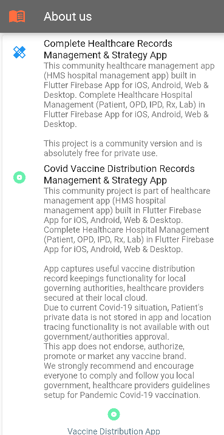
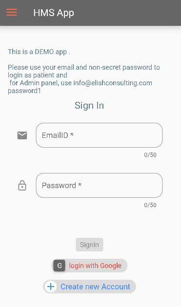
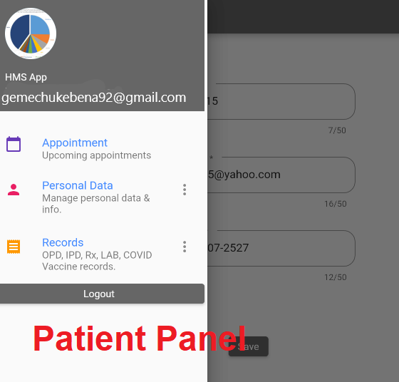
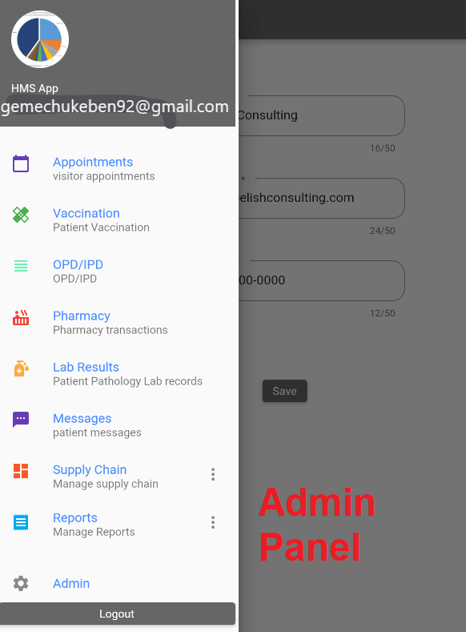

# Flutter FireBase Healthcare Management App For Arbaminch General Hospital
Note:This application was built for specific hospital so The database for this application is controlled by them and 
If you want to create your own application with your own database feel free to impelement
first click the following channel to view guidline for your project then if you get any trouble you can contact me through seminarkebnar@gmail.com or pu inside the comment section on my youtube channel
<p>Please Don't forget to subscribe first<a href="https://www.youtube.com/@KebnarTube-br8un/playlists">  🔗Click here</a></p> 
Complete Healthcare Management (Patient, OPD, IPD, Rx, Lab)  in Flutter Firebase App for iOS Android and Web

```diff
- If you like this project, please consider giving it a star (*) and follow me at GitHub & YouTube.
```
## Objective 
Manage OPD, IPD, Pathology, WebMD, Rx, Patient Appointments<br/><br/>
## Technologies
```sbtshell
Frontend: Flutter
Backend:
        Option 1: Google Firestore/Firebase
            or
        Option 2: NodeJS + Oracle or MYSql or MSSQL Server (not available as community version)
``` 
## Features
<ul>
<li>Store millions of records with lightening fast data retrieval</li>
<li>hands free /voice activated typing</li>
<li>Secured App (Role based access with Admin panel)</li>
<li>Local dictionary based auto-completion</li>
<li>Global dictionary based auto-completion/auto-sync (Pro)</li>
<li>GBs of pictures, documents, Lab reports, Receipts (Pro)</li>
<li>Self learning (auto complete) data entry (Pro)</li>
<li>Social authentication (Pro)</li>
<li>SMS, EMAIL, WhatsAPP API (Pro)</li>
</ul>
<i>send email to info@elishcosulting.com for Pro version enquiries.</i>

## Product Images




## How to Install
<ul>
    <li>Install Flutter environment</li>
    <li>Download This GitHub repository</li>
    <li>install Flutter packages *pub get) and Flutter web -> Flutter create .</li>
    <li>Setup firebase account/project</li>
    <li>Copy Firebase Project Config settings and replace variable firebaseConfig at src/web/index.html</li>
    <li>enable Firebase social authentications</li>
    <li>update Firebase Rules</li>
```sbtshell
    rules_version = '2';
    service cloud.firestore {
    match /databases/{database}/documents {
    match /{document=**} {
      allow read, write: if false;
    }
    match /roles/{document} {
    // fix this, anyone who is logged in, can read these document & passwords
    //  allow read: if isSignedIn();
  	allow read, write: if false;
    }
    
    match /users/{document} {
    allow create: if true;
    allow read : if isSignedIn() && (isDocOwner() || isAdmin());
    allow update: if isSignedIn() && isDocOwner() && onlyContentChanged();
    allow update, delete: if isAdmin();
    }
    
    match /person/{document=**} {
    allow create: if true;
    allow read, update : if isSignedIn() && (isDocOwner() || isAdmin());
    allow delete : if isSignedIn() && isAdmin();
    }
    
    match /person/{document}/Vaccine/{doc=**} {
    allow create: if true;
    // allow read, update : if isSignedIn() && (isDocOwner() || isAdmin());
    // fix this later
    allow read, update : if true;
    allow delete : if isSignedIn() && isAdmin();
    }
    
    match /person/{document}/OPD/{doc} {
    allow create: if true;
    // allow read, update : if isSignedIn() && (isDocOwner() || isAdmin());
    // fix this later
    allow read, update : if true;
    allow delete : if isSignedIn() && isAdmin();
    }
    
    match /person/{document}/Lab/{doc} {
    allow create: if true;
    // allow read, update : if isSignedIn() && (isDocOwner() || isAdmin());
    // fix this later
    allow read, update : if true;allow read, update : if isSignedIn() && (isDocOwner() || isAdmin());
    allow delete : if isSignedIn() && isAdmin();
    }
    
    match /person/{document}/Rx/{doc} {
    allow create: if true;
    // allow read, update : if isSignedIn() && (isDocOwner() || isAdmin());
    // fix this later
    allow read, update : if true;
    allow delete : if isSignedIn() && isAdmin();
    }
    
    match /person/{document}/Messages/{doc} {
    allow create: if true;
    // allow read, update : if isSignedIn() && (isDocOwner() || isAdmin());
    // fix this later
    allow read, update : if true;
    allow delete : if isSignedIn() && isAdmin();
    }
    
    match /appointments/{document} {
    allow create: if true;
    allow read, update : if isSignedIn() && (isDocOwner() || isAdmin());
    allow delete : if isSignedIn() && isAdmin();
    }
    
    match /records/{document} {
    allow create: if true;
    allow read, update : if isSignedIn() && (isDocOwner() || isAdmin());
    }
    
    match /vaccine/{document} {
    allow create: if true;
    allow read, update : if isSignedIn() && (isDocOwner() || isAdmin());
    }
    
    match /purchase/{document} {
    allow create: if true;
    allow read, update : if isSignedIn() && (isDocOwner() || isAdmin());
    allow delete : if isSignedIn() && isAdmin();
    }
    
		match /msr/{document} {
    allow create: if true;
    allow read, update : if isSignedIn() && (isDocOwner() || isAdmin());
    allow delete : if isSignedIn() && isAdmin();
    }
    
    match /vendor/{document} {
    allow create: if true;
    allow read, update : if isSignedIn() && (isDocOwner() || isAdmin());
    allow delete : if isSignedIn() && isAdmin();
    }
    
    match /warehouse/{document} {
    allow create: if true;
    allow read: if isSignedIn()
    allow update : if isSignedIn() && (isDocOwner() || isAdmin());
    allow delete : if isSignedIn() && isAdmin();
    }
    match /item/{document} {
    allow create: if true;
    allow read: if isSignedIn()
    allow update : if isSignedIn() && (isDocOwner() || isAdmin());
    allow delete : if isSignedIn() && isAdmin();
    }
    
    // helper functions
    function isSignedIn() {
    return request.auth.uid != null;
    }
    
    function onlyContentChanged() {
    return request.resource.data.role == resource.data.role;
    // make sure user is not signing in with any role or changin his role during update
    }
    function isDocOwner() {
    return request.auth.uid == resource.data.author;
    }
    // function isDocCreater() {
    // return request.auth.uid == request.resource.data.author;
    // }
    function isAdmin() {
    return get(/databases/$(database)/documents/users/$(request.auth.uid)).data.role == "admin";
    }
    // function isEmployee() {
    // return get(/databases/$(database)/documents/settings/$(request.auth.uid)).data.role == "employee";
    // }
    }
    }
```
</ul>


